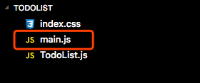
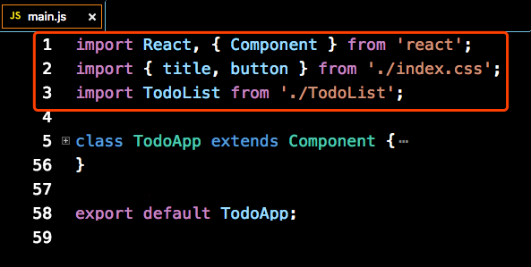
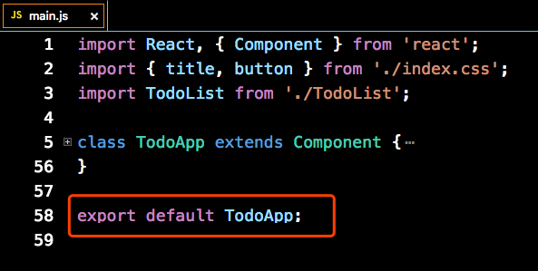
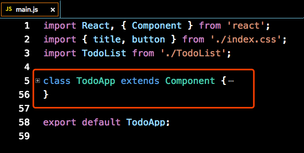
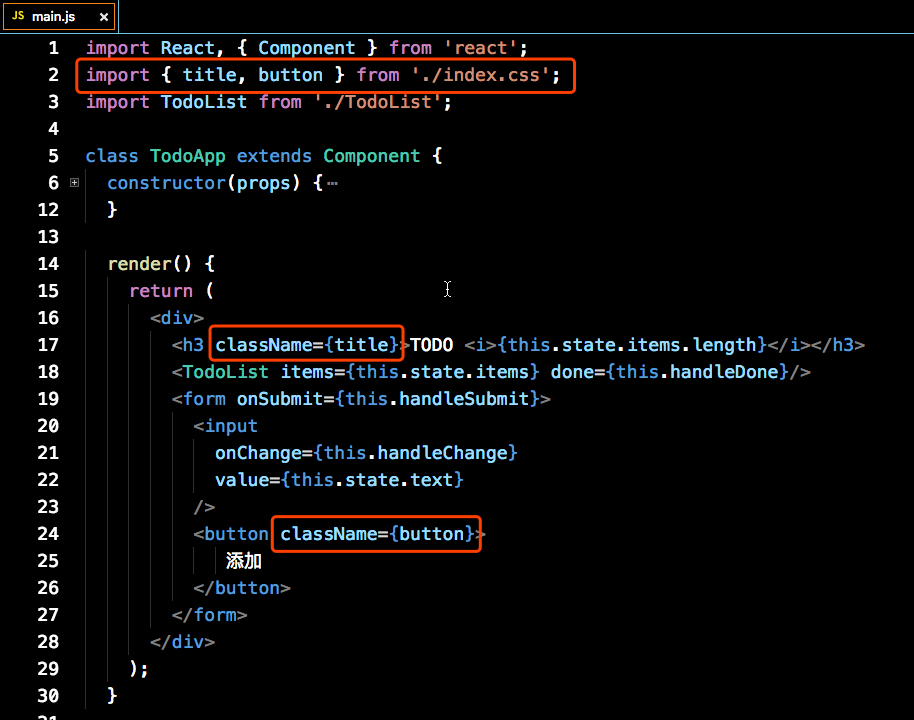
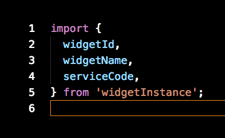
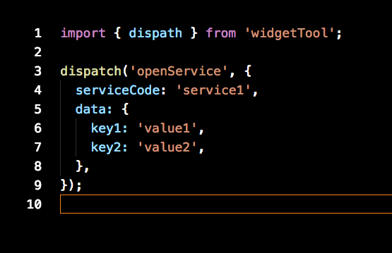
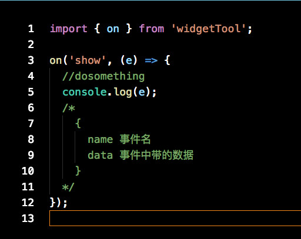
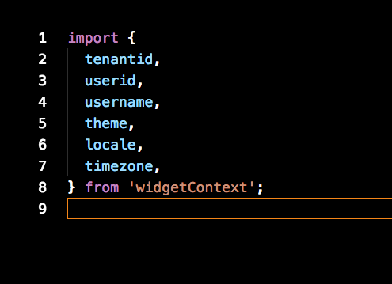

# 工作台前端集成文档

## 磁贴集成

### 目录规范

- 磁贴模板的开发代码必须放在一个文件夹里

  

- 文件夹中必须有一个main.js，这个文件是整个工程的入口文件

  

### 开发规范

- #### js

  - 开发中引用模块必须使用`import`命令

    

  - main.js的结尾，必须使用`export default`命令指定一个React组件类或者一个纯函数组件

    

  - 定义React组件类时，需要使用`class`关键字定义

    

- #### css

  - 目前只支持css和less两种格式的文件

  - 为了保证各个磁贴之间的css互不影响，所有css都会使用 Css Moudles 添加作用域，所以在其他模块中引用时，class名需要按照变量的方式引入，具体规范可参考 [这里](http://www.ruanyifeng.com/blog/2016/06/css_modules.html) 

    

- #### 集成

  开发中可以引用widgetInstance、widgetTool、widgetContext模块来完成与工作台的集成和交互

  - ##### widgetInstance

    该模块为当前磁贴数据的副本，包含以下几个属性：

    - widgetId

      当前磁贴的id

    - widgetName

      当前磁贴的名字

    - serviceCode

      磁贴对应的服务编码，可用于打开对应服务

    

  - ##### widgetTool

    该模块用于与工作台通信，目前提供以下两个方法：

    - dispatch({String} action, {Object} {…params})

      用于发送消息给工作台，执行指定动作，目前已有的动作有：

    - openService

        - 作用: 

          打开指定的服务

        - 参数:

          - {String} serviceCode

            要打开的服务的编码

          - {String} tenantId

            如果添加了tenantId，则会切换到指定租户后再打开服务。

          - {Object} data

            要传递给服务的数据，会作为请求参数添加到开启服务的链接中，所有参数都会经过转码，形式如下：

            ?key1=encodeURIComponent(value1)&key2=encodeURIComponent(value2)……

          - {Number} type
            指定type,看是打开service服务还是app应用.

        
        - dispath --> dispatch

    - on({String} eventName, {Function} callback)

      - 作用: 

        用于监听工作台的发出的事件，做出响应动作。

      - 参数:

        - {String} eventName

          事件名，目前的设计中，监听的事件是自定义的，对事件命名没有限制。由于工作台会给每个组件添加作用域，所以不用担心与其他组件冲突。

        - {Function} callback

          事件回调，工作台对当前磁贴发出指定事件时执行，回调函数接收一个事件对象作为参数

      - 返回值:

        - {Function} remove

          执行后取消当前事件的监听

      

  - ##### widgetContext

    当前环境的上下文数据，包含以下几个属性：

    - tenantid

      租户Id

    - userid

      用户Id

    - username

      用户名

    - theme

      当前主题

    - locale

      当前语言

    - timezone

      当前时区

      

- #### 注册

  磁贴模板开发完成后，需要将代码打包成一个zip，在运维平台上传，才能完成注册。
  
  上传地址为：http://widget-pack-new.online.app.yyuap.com/widget-pack
  
  注：词贴内部远程请求跨域问题，需要接口服务器响应头增加允许跨域的配置，如：Access-Control-Allow-Origin:*
  
  注册时除了指定磁贴模板，还能指定磁贴的大小，背景图片等属性。目前支持的磁贴打下有以下9种：  
  - {width: 175, height: 175}
  - {width: 360, height: 175}
  - {width: 360, height: 360}
  - {width: 545, height: 175}
  - {width: 545, height: 360}
  - {width: 730, height: 175}
  - {width: 730, height: 360}
  - {width: 1100, height: 360}
  - {width: 1100, height: 730}

#### 其他建议

  规范对实现磁贴的具体实现没有特别要求，但是在这里不建议直接使用dom操作来控制磁贴的内容，建议利用react的功能，使用数据控制界面变化。后续的迭代中可能在运维平台上添加校验，禁止直接的dom操作。

